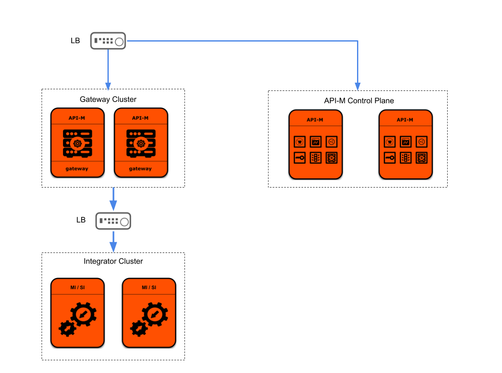

# Customize WSO2 Ansible resources to deploy API Manager Pattern 3

This document provides instructions required to deploy API Manager Pattern 3.



## Setting up Java
The Ansible scripts are capable of installing java from a given JDK installer from the local file system or from the remote location. Java installation can be disabled if necessary from the `group_vars`. 

Copy the following files to `files/lib` directory.

1. [Amazon Corretto JDK 11 for Linux x64 (.tar.gz)ß](https://docs.aws.amazon.com/corretto/latest/corretto-11-ug/downloads-list.html)

## Adding miscellaneous files
If additional files needs to be added to the VMs, copy the miscellaneous files to `files/misc` directory. To enable file copying,  uncomment the `misc_file_list` in the yaml files under `group_vars` and add the miscellaneous files to the list.

## Packs to be Copied

Copy the following files to `files/packs` directory. (Packs must be copied as per the required components). You need to add the ZIP Archive of the WSO2 distributions.

1. [WSO2 API Manager 4.1.0 package (.zip)](https://github.com/wso2/product-apim/releases/tag/v4.1.0)
2. [WSO2 Micro Integrator 4.1.0 package (.zip)](https://github.com/wso2/micro-integrator/releases/tag/v4.1.0)

## Database configurations

In a production environment we recommend using an external database to store WSO2 application data. Follow the below steps to configure the database. 

1. Copy the relevant JDBC driver needed into `files/lib` directory.
e.g : [MySQL Connector/J](https://dev.mysql.com/downloads/connector/j/5.1.html)
2. Update the database configurations in all the files under [group_vars](../dev/group_vars). In the files update `Datasource configurations section` and the `jdbc_driver` parameter.

## Keystore configurations

Inorder to change the default keystores of the WSO2 server follow the instructions below.

1. Add the primary, internal, tls keystore and the client-trustore under files/security/<product-home>.
2. Uncomment the Keystore Configurations sections in all the files under [group_vars](../dev/group_vars) and if the keystore names are different from the defaults make sure these changes are done.

## Customize the WSO2 Ansible scripts

The followings are the roles needed to deploy API Manager pattern 3.

- apim-control-plane
- apim-gateway
- micro-integrator

### 1. Customize the [inventory](../dev/inventory) file

#### Replace the inventory file content with the followings.

```
[apim]
apim-control-plane_1 ansible_host=[ip_address] ansible_user=[ssh_user]
apim-control-plane_2 ansible_host=[ip_address] ansible_user=[ssh_user]
apim-gateway_1 ansible_host=[ip_address] ansible_user=[ssh_user]
apim-gateway_2 ansible_host=[ip_address] ansible_user=[ssh_user]

[micro-integrator]
micro-integrator_1 ansible_host=[ip_address] ansible_user=[ssh_user]
micro-integrator_2 ansible_host=[ip_address] ansible_user=[ssh_user]

```
> NOTE: Replace `[ip_address]` and `[ssh_user]` appropriately.

### 2. Modify the [site.yml](../site.yml) file

```
---
# This playbook deploys the whole application stack in this site.

- name: Apply common configuration to all nodes
  hosts: all
  roles:
    - common

- name: Apply API Manager control plane configuration to control plane nodes
  hosts:
    - apim-control-plane_1
    - apim-control-plane_2
  roles:
    - apim-control-plane

- name: Apply API Manager gateway configuration to gateway nodes
  hosts:
    - apim-gateway_1
    - apim-gateway_2
  roles:
    - apim-gateway
    
- name: Apply Micro Integrator configuration to MI nodes
  hosts:
    - micro-integrator_1
    - micro-integrator_2
  roles:
    - micro-integrator
```

### 3. Customize the roles for API Manager pattern 3
API Manager pattern 3 contains 2 groups and the configurations specific for each group should be in the respective yaml file under [group_vars](../dev/group_vars) folder. Configurations specific to each host should be added to the corresponding yaml file under [host_vars](../dev/host_vars) folder.

```
.
└── dev
    ├── group_vars
    │   ├── apim.yml
    │   └── apim-micro-integrator.yml
    ├── host_vars
    │   ├── apim-control-plane_1.yml
    │   ├── apim-control-plane_2.yml
    │   ├── apim-gateway_1.yml
    │   ├── apim-gateway_2.yml
    │   ├── micro-integrator_1.yml
    │   └── micro-integrator_2.yml
    └── inventory

```
Most commonly changed values are parameterized in the above files. If further changes are required, the values should be parameterized and added to the files accordingly.

#### i. Customize `apim-control-plane` role

Navigate to [carbon-home](../roles/apim-control-plane/templates/carbon-home) of the `apim-control-plane` role. Follow the instructions in the following [document](https://apim.docs.wso2.com/en/latest/install-and-setup/setup/distributed-deployment/deploying-wso2-api-m-in-a-distributed-setup/#configure-the-control-plane-nodes) to modify the files.

#### ii. Customize `apim-gateway` role

Navigate to [carbon-home](../roles/apim-gateway/templates/carbon-home) of the `apim-gateway` role. Follow the instructions in the [document](https://apim.docs.wso2.com/en/latest/install-and-setup/setup/distributed-deployment/deploying-wso2-api-m-in-a-distributed-setup/#configure-the-gateway-nodes) and modify the files.

#### iii. Customize `micro-integrator` role

Navigate to [carbon-home](../roles/micro-integrator/templates/carbon-home) of the `micro-integrator` role. Follow the instructions in the [document](https://apim.docs.wso2.com/en/latest/reference/config-catalog-mi/) and modify the files.

### 4. Further customization

Uncomment the following line in `main.yml` under the role you want to customize and add the necessary changes.
```
- import_tasks: custom.yml
```
